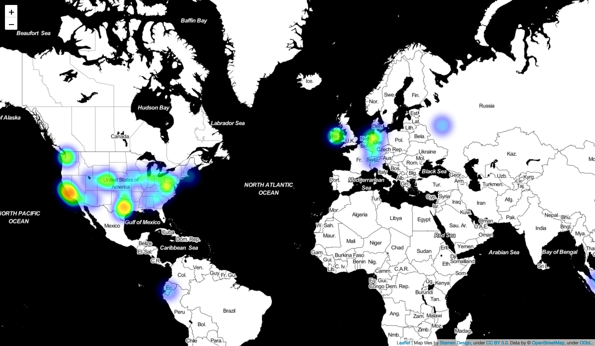

## Where Is Your Internet IRL?

#### Track and plot the physical location of your internet traffic.

It's easy to forget that everything we see online has a physical location. All the videos we watch, text we read, ads we see, and even this README are being stored somewhere inside a server. This is a tool to track and subsequentally plot the physical location of those servers.



__Explore an [interactive version of this map](https://zekemedley.github.io/Where-Is-Your-Internet-IRL/index.html).__


### How to use it

In order to run this locally you'll need [Zeek installed](https://docs.zeek.org/en/stable/install/install.html) with its [GeoLocation features](https://docs.zeek.org/en/stable/frameworks/geoip.html#geolocation) and iPython on your machine. With those installed, run

```
pip install folium
```

to install the mapping library that this uses. With everything installed, run

```
zeek -i en0 logger.zeek >> loc.data
```

to collect the data that we'll need and pipe it to a file called `loc.data`. While this is running it will write out location information about your internet traffic. Leave it on in the background for a while while your surf the web so it can get some good data.


Finally, to generate the heat map go ahead and open up either the included Wolfram Language or iPython notebook and run through it.

This project was ideated and designed by [Annalise](https://akamegawa98.github.io/hello.html) and implemented by me.
